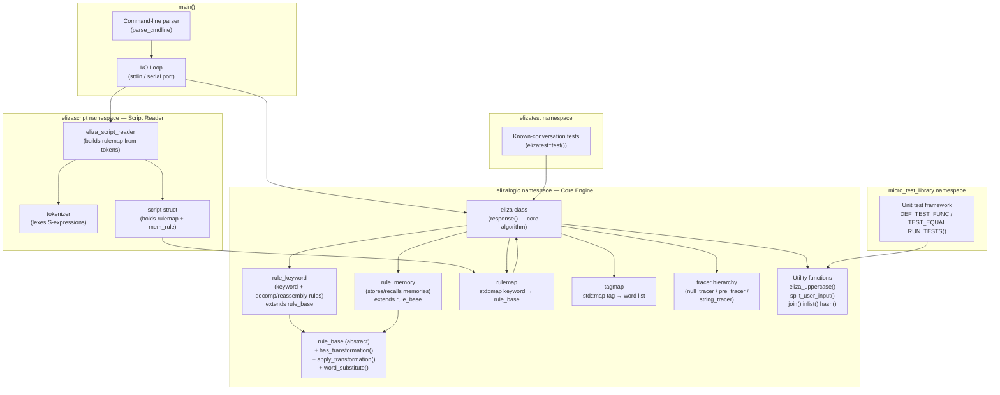
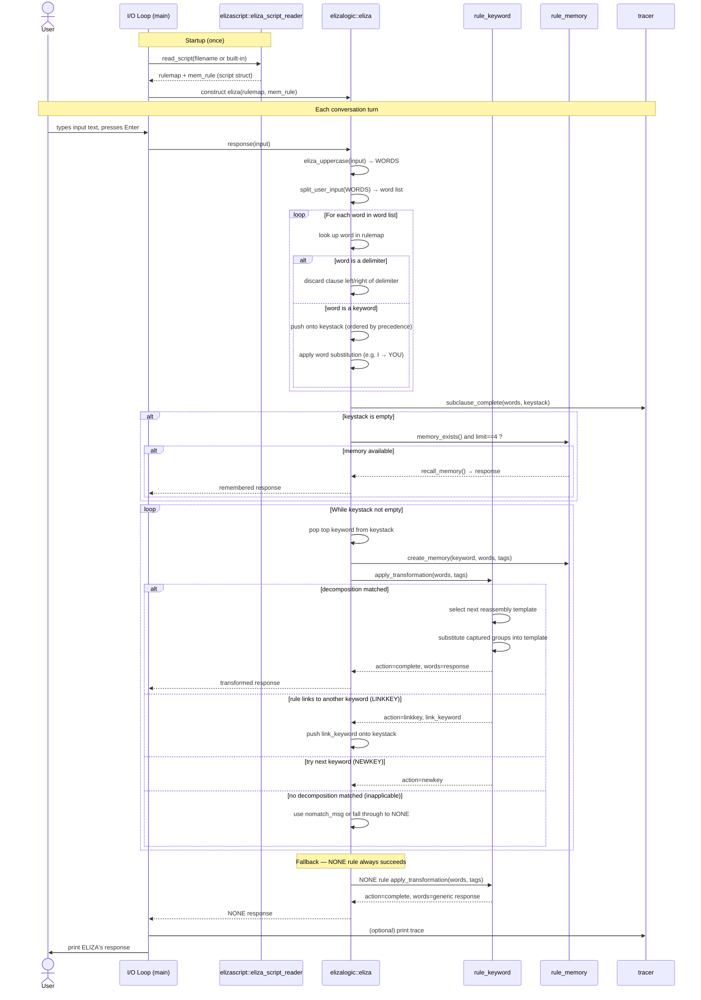

# ELIZA — Explanation, Component Diagram & Sequence Diagram

## What is ELIZA?

ELIZA is the world's first chatbot. It was created at MIT by Joseph Weizenbaum between 1964 and 1966 and described in his landmark paper:

> *ELIZA — A Computer Program For the Study of Natural Language Communication Between Man And Machine*  
> Communications of the ACM, January 1966.

### How it works

ELIZA is **script-driven**. A script (a text file of S-expression-like rules) tells ELIZA which keywords to look for in the user's input and how to transform those sentences into a response. The most famous script is **DOCTOR**, which makes ELIZA impersonate a Rogerian psychotherapist.

The algorithm, at its core:

1. **Input normalisation** — The user's text is upper-cased and punctuation is normalised. Clauses are split at delimiters (`,` `.` `BUT`).
2. **Keyword scanning** — Every word in the (first relevant clause of) the input is looked up in a rule map. Matching keywords are pushed onto a *keystack*, ordered by their assigned precedence.  Word substitutions (e.g. `I → YOU`) are applied simultaneously.
3. **Transformation** — The highest-priority keyword's *decomposition rules* are tried in order against the (now-substituted) input words. The first rule that matches extracts variable portions of the text and inserts them into a *reassembly template*.
4. **Memory** — A special `MEMORY` rule stores interesting earlier statements. When the keystack is empty and an internal counter (`LIMIT`) reaches 4, ELIZA recalls one of these memories as its reply.
5. **Fallback** — A mandatory `NONE` rule produces a vague reply whenever no keyword matches at all.

### Key concepts

| Term | Meaning |
|------|---------|
| **Script** | Text file of keyword rules in a LISP-like S-expression format |
| **Keyword** | A word that triggers a transformation rule (e.g. `MOTHER`, `DREAM`) |
| **Precedence** | Integer priority; higher-ranked keywords win when multiple keywords appear in one sentence |
| **Decomposition rule** | A pattern that matches against the (normalised) user input |
| **Reassembly rule** | A template that constructs the response, referring to groups captured by the decomposition |
| **MEMORY rule** | Stores a past response for later reuse when input has no keywords |
| **NONE rule** | Catch-all that always produces a response |
| **NEWKEY action** | Tells ELIZA to abandon the current keyword and try the next one on the keystack |
| **LINKKEY action** | Redirects processing to a different keyword's rule |
| **Tag** | A named set of words (e.g. `FAMILY` → `MOTHER FATHER SISTER …`) used in decomposition patterns |

---

## Component Diagram

### Component descriptions

| Component | Responsibility |
|-----------|---------------|
| **`main()`** | Entry point. Parses CLI flags, reads script file (or uses built-in DOCTOR script), runs tests, then enters the I/O conversation loop. |
| **`parse_cmdline`** | Interprets `--help`, `--nobanner`, `--slow`, `--showscript`, `--port` flags. |
| **I/O Loop** | Reads user input from `stdin` (or serial port), calls `eliza::response()`, prints ELIZA's reply. Handles meta-commands (`*trace`, `*key`, `*cacm`, …). |
| **`elizascript::tokenizer`** | Breaks the script text into tokens (parentheses, numbers, words). |
| **`elizascript::eliza_script_reader`** | Parses the token stream into a `rulemap` containing `rule_keyword` and `rule_memory` objects. |
| **`elizascript::script`** | Plain struct bundling the parsed `rulemap` and the single `rule_memory` pointer. |
| **`elizalogic::eliza`** | The ELIZA engine. `response(input)` implements the complete 1966 algorithm: uppercase conversion, keyword scanning, keystack management, decomposition/reassembly, memory recall, and NONE fallback. |
| **`elizalogic::rule_base`** | Abstract base class shared by all rule types. Provides the common interface (`apply_transformation`, `word_substitute`, `precedence`, …). |
| **`elizalogic::rule_keyword`** | Holds one keyword's priority, word-substitution entry, and list of decomposition/reassembly rule pairs. Cycles through reassembly templates to avoid repetition. |
| **`elizalogic::rule_memory`** | Accumulates up to 5 candidate memory sentences; recalls them round-robin when LIMIT==4 and the keystack is empty. |
| **`rulemap`** | `std::map<string, shared_ptr<rule_base>>` — the central lookup table keyed on keyword. Also stores special entries `NONE` and `MEMORY`. |
| **`tagmap`** | `std::map<string, stringlist>` — maps tag names (e.g. `FAMILY`) to their member words, used in `(/TAG)` decomposition patterns. |
| **`tracer` hierarchy** | Optional observer injected into `eliza`. Captures each step of the algorithm for the `*trace` / `*traceauto` commands. |
| **Utility functions** | `eliza_uppercase` (Unicode-aware), `split_user_input`, `join`, `inlist` (tag/list matching), `hash` (SLIP hash used in the original). |
| **`elizatest`** | Replays the published 1966 CACM conversation and asserts the output matches exactly. |
| **`micro_test_library`** | Minimal unit-test framework (`DEF_TEST_FUNC`, `TEST_EQUAL`, `RUN_TESTS`). |

---

## Sequence Diagram

The diagram below shows a single turn of conversation — from the user pressing Enter to ELIZA printing its reply.

### Sequence walk-through

| Step | What happens |
|------|-------------|
| **Startup** | The script reader tokenises and parses the script file (or the built-in DOCTOR script) into a `rulemap`. The `eliza` object is constructed with that map. |
| **Input normalisation** | `eliza_uppercase()` converts the user's text to upper-case, normalises Unicode punctuation, and maps special characters to their nearest BCD equivalents. `split_user_input()` tokenises the result into a `stringlist`. |
| **Keyword scan** | Every word is looked up in the `rulemap`. Keyword words are pushed onto the `keystack` in descending priority order; word substitutions (e.g. `I AM → YOU ARE`) are applied in the same pass. Clauses after the first keyword-bearing clause are discarded. |
| **Memory recall** | If the keystack is empty *and* the internal `LIMIT` counter equals 4 *and* the memory bank is non-empty, ELIZA returns a stored memory sentence without consulting the rules at all. |
| **Transformation loop** | The top keyword is popped. Its `rule_keyword` object tries each decomposition pattern in order. On a match, the next reassembly template (cycling round-robin) is filled with the captured text groups and returned. |
| **LINKKEY / NEWKEY** | A rule may redirect to another keyword (`LINKKEY`) or ask ELIZA to try the next one in the stack (`NEWKEY`). |
| **NONE fallback** | If the keystack is exhausted without a successful transformation, the mandatory `NONE` rule produces a generic reply (e.g. `PLEASE GO ON`). |
| **Tracing** | At any point, a `tracer` object observes and records each step; the user can inspect it with the `*` or `*traceauto` commands. |
